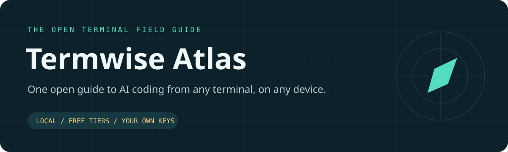
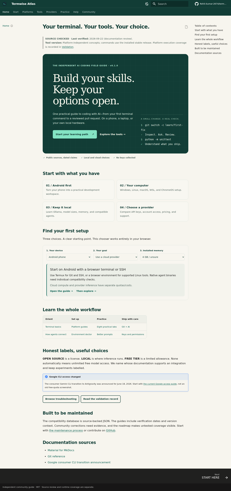

<p align="center"></p>

<p align="center">
<a href="https://github.com/Rohit-kumar-2674/termwise-atlas/actions/workflows/verify.yml"></a>


</p>

# Your terminal. Your tools. Your choice.

**Termwise Atlas** is a practical, independent learning hub for AI coding assistants. Learn the terminal, choose a legitimate model provider, make a small change, review the diff, and ship it with tests. Start on a phone; grow into a workstation.

**[Live documentation](https://rohit-kumar-2674.github.io/termwise-atlas/)** · **[START HERE](docs/getting-started/start-here.md)** · **[Choose a setup](docs/getting-started/choose.md)** · **[Compatibility matrix](docs/getting-started/comparison.md)** · **[Android first](docs/platforms/android.md)** · **[Troubleshooting](docs/troubleshooting/index.md)**

> **Current Google transition:** Google's consumer Gemini CLI sign-in routes were scheduled to move to Antigravity CLI on June 18, 2026. The Gemini guide covers the remaining documented API/enterprise routes and links to the current [migration path](docs/tools/antigravity.md). Old quota screenshots are not an entitlement.

## Start with what you have

| Your situation | First stop | What you will accomplish |
| --- | --- | --- |
| Only an Android phone | [AI coding from Android](docs/platforms/android.md) | Choose native Termux, Debian/Ubuntu userland, or a remote browser terminal |
| Windows computer | [Windows](docs/platforms/windows.md) or [WSL](docs/platforms/wsl.md) | Set up a supported shell and a separate development environment |
| Linux or macOS | [Linux](docs/platforms/linux.md) / [macOS](docs/platforms/macos.md) | Install a tool, authenticate, and inspect a repository |
| No GPU, limited RAM | [Hardware guide](docs/providers/hardware.md) | Compare a small local exercise with cloud model calls |
| Keep inference on your hardware | [Ollama lab](docs/providers/ollama.md) | Download one model, run it, and connect Aider |
| One key, multiple providers | [OpenRouter](docs/providers/openrouter.md) | Choose a model ID and inspect price, limits, and data routing |
| An error is blocking you | [Troubleshooting database](docs/troubleshooting/index.md) | Follow symptom → cause → check → fix → verify |

## Understand the labels

**FREE** refers to software or a specifically identified no-charge service. **FREE TIER** is limited cloud access. **LOCAL** means inference runs on your selected hardware. **OPEN SOURCE** describes a software license, not model pricing. **PAID API REQUIRED** and **OPTIONAL PAID PROVIDER** mean exactly what they say. Hardware, electricity, cloud machines, storage, and network traffic can still cost money.

| Tool | Software / model cost | OpenRouter | Ollama |
| --- | --- | --- | --- |
| [Claude Code](docs/tools/claude-code.md) | Proprietary; official cloud access requires eligible paid access | Provider-documented; Anthropic model compatibility caveats | Ollama-documented compatibility route |
| [Gemini CLI](docs/tools/gemini-cli.md) | Apache-2.0; retained paid API / enterprise routes | No reviewed native route | No reviewed native route |
| [OpenAI Codex CLI](docs/tools/codex.md) | Apache-2.0; plan/API/local choice | Provider-documented custom provider | Official OSS mode |
| [Aider](docs/tools/aider.md) | Apache-2.0; local or chosen API | Tool-documented | Tool-documented |
| [OpenCode](docs/tools/opencode.md) | MIT; provider-dependent | Built-in provider | Documented local provider |
| [Continue](docs/tools/continue.md) | Apache-2.0; provider-dependent | Documented config; CLI/IDE differences explained | Documented config; model capability matters |
| [Antigravity CLI](docs/tools/antigravity.md) | Google terms; account quota / optional paid usage | Not established by reviewed docs | Not established by reviewed docs |

See the [full matrix](docs/getting-started/comparison.md) for platform and evidence labels. Native Android support is never inferred from a Linux badge. This project is not affiliated with the tool vendors.

## A real learning path

1. **Orient:** [Terminal basics](docs/getting-started/terminal-basics.md), [provider architecture](docs/getting-started/ecosystem.md), and [costs](docs/getting-started/costs.md).
2. **Set up:** Pick one platform guide and one tool. Use the [read-only doctor](docs/getting-started/diagnostics.md).
3. **Practice:** Complete the [eight guided labs](docs/examples/index.md), including a working Python fixture, website, test generation, and React project.
4. **Review:** Use the [Git workflow](docs/git/workflow.md), [API-key guide](docs/security/api-keys.md), and [agent safety guide](docs/security/agent-safety.md).
5. **Maintain:** Submit a sourced correction with a tool version and a reproducible check.

## Run the guide locally

Reading Markdown on GitHub needs no installation. The doctor and wizard use only Python's standard library and never install tools, ask for key values, or upload reports.

```bash
python3 scripts/doctor.py
python3 scripts/wizard.py
```

Windows: use `py -3` in place of `python3`.

For the documentation site, use Python 3.11+ in a virtual environment:

```bash
python3 -m venv .venv
.venv/bin/python -m pip install -r requirements-docs.lock
.venv/bin/python scripts/render_data.py
.venv/bin/python -m mkdocs serve --dev-addr 127.0.0.1:8000
```

PowerShell:

```powershell
py -3 -m venv .venv
.\.venv\Scripts\python.exe -m pip install -r requirements-docs.lock
.\.venv\Scripts\python.exe scripts/render_data.py
.\.venv\Scripts\python.exe -m mkdocs serve --dev-addr 127.0.0.1:8000
```

Open `http://127.0.0.1:8000`. No execution-policy changes are needed. [Build, test, and publish instructions](docs/maintenance/development.md) cover the remaining commands.

## The documentation experience

Search, dark/light mode, copy buttons, platform tabs, a keyboard-accessible setup chooser, filterable compatibility cards, and mobile navigation are included. Browsing the built guide never calls a model API or collects an API key. Fonts and scripts are served locally.



[Live website](https://rohit-kumar-2674.github.io/termwise-atlas/) · [Mobile screenshot](assets/screenshots/mobile-home.png) · [Deployment preview](assets/screenshots/live-site-20260926.jpg) · [Build the documentation website](docs/maintenance/development.md)

## Architecture

| Layer | Responsibility |
| --- | --- |
| `docs/` | Canonical English guides, source links, version notes, eight labs |
| `data/` | Reviewed compatibility records, models, learning routes, source registry |
| `scripts/` | Read-only diagnostics, instruction-only wizard, deterministic data rendering and validation |
| `configs/` | Credential-free examples; each states the intended client and loading behavior |
| `examples/` | Small, runnable projects with deterministic checks and reference solutions |
| `tests/` | Security, routing, structure, script, and browser regression checks |
| `.github/` | Cross-platform verification, source-link checking, issue forms, and PR checklist |

## Trust and maintenance

Each guide separates **source review** from **runtime testing**. The [validation record](docs/maintenance/validation.md) says what actually ran. Installation methods, authentication behavior, and compatibility claims link to primary sources. Versions are snapshots, not promises of permanent compatibility. The [maintenance process](docs/maintenance/index.md) defines how claims are updated and how stale records are surfaced.

The model table contains illustrative, tagged local options—not a permanent leaderboard. Memory ranges are planning estimates, not benchmarks. Tool licenses and model licenses are separate.

## Contribute

Bring platform fixes, especially from Android devices, reproducible error reports, and current official sources. Start with [CONTRIBUTING](CONTRIBUTING.md), the [guide template](docs/maintenance/guide-template.md), and [Code of Conduct](CODE_OF_CONDUCT.md). Never post keys, auth files, or unredacted logs in an issue. See [SECURITY](SECURITY.md).

[Roadmap](ROADMAP.md) · [FAQ](docs/faq/index.md) · [Translation plan](docs/maintenance/translations.md) · [Changelog](CHANGELOG.md) · [MIT license](LICENSE)
